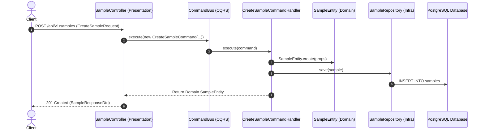

# NestJS Clean Architecture & CQRS Boilerplate

Boilerplate chuẩn doanh nghiệp (Enterprise-ready) tinh gọn và rõ ràng, được xây dựng dựa trên **Clean Architecture**, **Domain-Driven Design (DDD)** và **CQRS (Command Query Responsibility Segregation)** trên nền tảng **NestJS** và **TypeORM (PostgreSQL)**.

---

## 🚀 Tính năng nổi bật (Key Features)

- **Kiến trúc phân tầng sạch (Clean Architecture & DDD)**: Tách biệt hoàn toàn giữa tầng Domain, Use-case (Application), Infrastructure và Presentation. Business logic không phụ thuộc vào framework hay cơ sở dữ liệu.
- **CQRS Pattern (@nestjs/cqrs)**: Tách bạch rõ ràng giữa Commands (Ghi/Sửa/Xóa dữ liệu), Queries (Đọc dữ liệu) và Events (Xử lý sự kiện nội bộ).
- **Dependency Inversion (DI Tokens)**: Sử dụng Symbol DI Token để đảo ngược phụ thuộc giữa Domain và Infrastructure.
- **Cơ sở dữ liệu (TypeORM & PostgreSQL)**: Cấu hình Data Source tối ưu, tự động mapping snake_case naming strategy, hỗ trợ Migration và Database Seeding (`typeorm-extension`).
- **Global Exception Filter chuẩn Clean Architecture**: Tự động nhận diện Domain Exception (`BaseException`), NestJS `HttpException`, và Validation errors để map HTTP status code chuẩn xác (404, 409, 400...).
- **Tài liệu API tự động (Swagger/OpenAPI)**: Tự động sinh tài liệu API trực quan tại `/swagger`.
- **Bộ khung thuần khiết (Pure Skeleton)**: Không chứa logic nghiệp vụ dư thừa, dễ dàng sao chép và mở rộng cho bất kỳ dự án nào.

---

## 📁 Cấu trúc thư mục (Directory Structure)

```text
nest-clean-architecture-boilerplate/
├── docker-compose.yml              # Dựng trọn bộ: Backend + PostgreSQL
├── .env.example                    # Biến môi trường mẫu
├── postgres/                       # Dockerfile & script khởi tạo PostgreSQL
└── backend/
    ├── Dockerfile                  # Multi-stage Docker build
    ├── start.sh                    # Script chạy migration -> seed -> start app
    ├── package.json
    ├── tsconfig.json
    └── src/
        ├── main.ts                 # Bootstrap REST API & Swagger
        ├── app.module.ts           # Root module
        │
        ├── filter/                 # Exception filters (LoggingExceptionFilter)
        ├── utils/                  # Tiện ích chung (UUID crypto)
        │
        ├── shared/                 # Core dùng chung cho toàn bộ ứng dụng
        │   ├── shared.module.ts    # Global Module
        │   ├── configuration/      # Config Swagger, Logging, Naming Strategy
        │   ├── services/           # ApiConfigService (type-safe config)
        │   ├── domain/             # Base Entity, Base Repo, Base Exception, VOs
        │   └── infra/              # TypeORM setup & config
        │
        └── modules/
            └── sample/             # [MODULE KHUNG MẪU] Skeleton tham chiếu chuẩn
                ├── sample.di-token.ts
                ├── sample.module.ts
                ├── domain/
                │   ├── entities/sample.entity.ts
                │   ├── repositories/sample.repository.ts
                │   └── exceptions/sample-not-found.exception.ts
                ├── use-case/
                │   ├── commands/
                │   │   ├── create-sample.command.ts
                │   │   └── create-sample.command.handler.ts
                │   └── queries/
                │       ├── get-sample-by-id.query.ts
                │       └── get-sample-by-id.query.handler.ts
                ├── infra/
                │   ├── persistence/
                │   │   ├── sample.typeorm-entity.ts
                │   │   └── sample.repository.ts
                │   └── mappers/sample.mapper.ts
                └── presentation/
                    ├── controllers/sample.controller.ts
                    ├── request/create-sample.request.ts
                    └── response/sample.response.dto.ts
```

---

## 🔄 Luồng xử lý CQRS (CQRS Architecture Flow)



---

## 🛠️ Hướng dẫn cài đặt & Khởi chạy

### Cách 1: Khởi chạy bằng Docker Compose (Khuyên dùng)

Chỉ với **1 lệnh duy nhất**, Docker sẽ khởi tạo PostgreSQL và Backend:

```bash
cd nest-clean-architecture-boilerplate
docker-compose up --build -d
```

- **Backend API**: `http://localhost:3001/api/v1`
- **Swagger Docs**: `http://localhost:3001/swagger`
- **PostgreSQL**: `localhost:5432` (User/Pass: `postgres`/`postgres`)

---

### Cách 2: Khởi chạy trực tiếp trên máy (Local Development)

#### 1. Cài đặt dependencies:
```bash
cd nest-clean-architecture-boilerplate/backend
npm install
```

#### 2. Cấu hình biến môi trường:
Tạo file `.env` từ `.env.example`:
```bash
cp .env.example .env
```
Chỉnh sửa thông số kết nối Database cho phù hợp với máy của bạn.

#### 3. Chạy Database Migrations:
```bash
npm run migration:run
```

#### 4. Khởi chạy ứng dụng:
```bash
npm run start:dev
```

---

## 📋 Hướng dẫn thêm Module mới chuẩn Clean Architecture & CQRS

Khi bạn muốn thêm một tính năng/domain mới (ví dụ `products`):

### Bước 1: Tạo cấu trúc thư mục
Tạo thư mục `src/modules/products/` với các thư mục con:
- `domain/`: `entities/`, `repositories/`, `exceptions/`
- `use-case/`: `commands/`, `queries/`
- `infra/`: `persistence/`, `mappers/`
- `presentation/`: `controllers/`, `request/`, `response/`

### Bước 2: Định nghĩa DI Token
Tạo `products/product.di-token.ts`:
```typescript
export const PRODUCT_DI_TOKEN = {
  REPOSITORY: Symbol("PRODUCT_REPOSITORY"),
} as const;
```

### Bước 3: Xây dựng Domain Model & Repository Interface
1. Tạo Entity kế thừa `BaseEntity` tại `domain/entities/product.entity.ts`.
2. Tạo interface `ProductRepository` kế thừa `BaseRepository<ProductEntity>` tại `domain/repositories/product.repository.ts`.

### Bước 4: Tạo Tầng Hạ Tầng (Infrastructure)
1. Tạo TypeORM entity kế thừa `AbstractEntity` tại `infra/persistence/product.typeorm-entity.ts`.
2. Tạo mapper chuyển đổi 2 chiều giữa Domain Entity và TypeORM Entity tại `infra/mappers/product.mapper.ts`.
3. Tạo repository class triển khai interface `ProductRepository` tại `infra/persistence/product.repository.ts`.

### Bước 5: Viết Use Cases (CQRS)
1. **Command**: Tạo `CreateProductCommand` và `CreateProductCommandHandler`.
2. **Query**: Tạo `GetProductByIdQuery` và `GetProductByIdQueryHandler`.

### Bước 6: Xây dựng Presentation Layer
1. Tạo DTOs validation tại `presentation/request/` và `presentation/response/`.
2. Tạo Controller inject `CommandBus` và `QueryBus` tại `presentation/controllers/product.controller.ts`.

### Bước 7: Khai báo Module
Tạo `products.module.ts`:
```typescript
@Module({
  imports: [CqrsModule, TypeOrmModule.forFeature([ProductTypeormEntity])],
  controllers: [ProductController],
  providers: [
    {
      provide: PRODUCT_DI_TOKEN.REPOSITORY,
      useClass: TypeOrmProductRepository,
    },
    ...commandHandlers,
    ...queryHandlers,
  ],
  exports: [PRODUCT_DI_TOKEN.REPOSITORY],
})
export class ProductsModule {}
```
Cuối cùng, import `ProductsModule` vào `app.module.ts`.

---

## 📜 Các lệnh Scripts hữu ích (NPM Scripts)

| Lệnh | Ý nghĩa |
| :--- | :--- |
| `npm run start:dev` | Chạy ứng dụng ở chế độ dev (watch mode) |
| `npm run build` | Biên dịch TypeScript sang JavaScript trong `dist/` |
| `npm run lint` | Kiểm tra và sửa lỗi coding convention với ESLint |
| `npm run format` | Tự động format code với Prettier |
| `npm run migration:create -- name=MigrationName` | Tạo một file migration mới |
| `npm run migration:generate -- name=MigrationName` | Tự động sinh migration từ Entity thay đổi |
| `npm run migration:run` | Áp dụng các migration chưa chạy vào Database |
| `npm run migration:revert` | Hoàn tác migration gần nhất |
| `npm run test` | Chạy unit test với Jest |

---

## 🛡️ License

Dự án phát hành theo giấy phép MIT.
